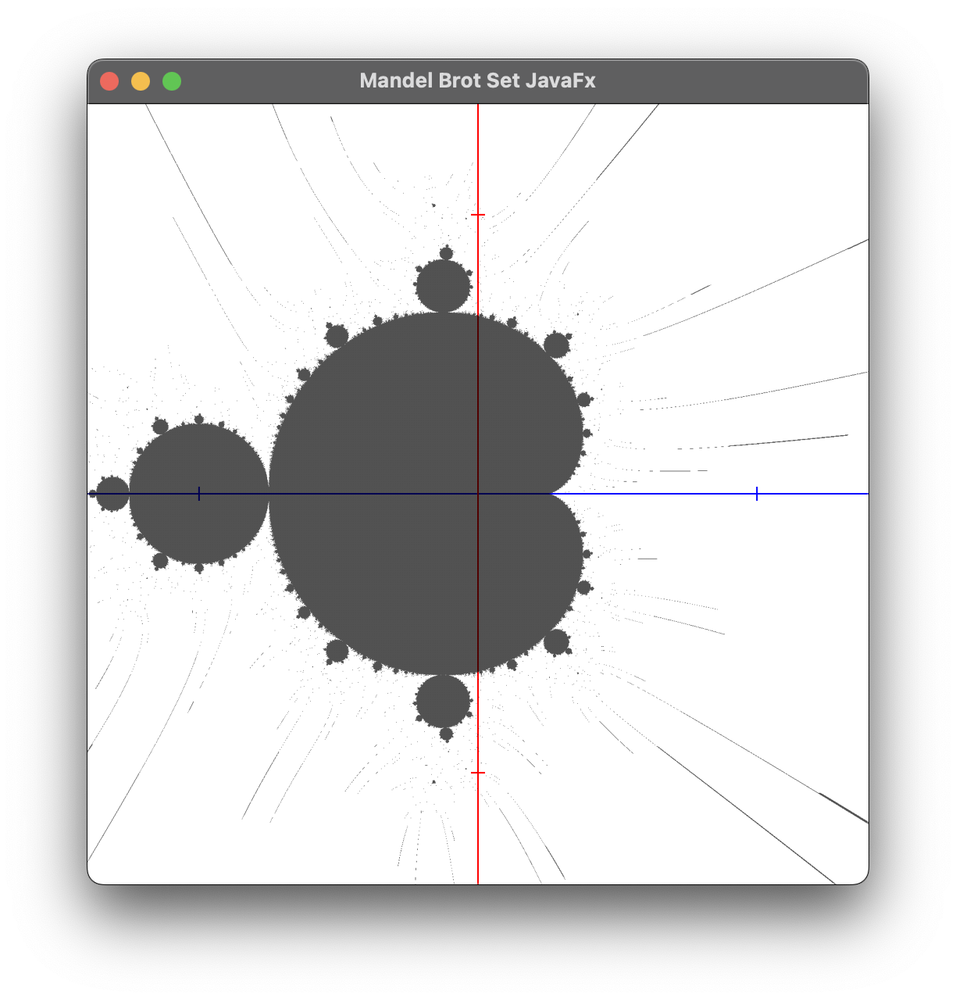

# mandelBrot

A simple Mandelbrot set generator

### How to use

Feel free to Use .vscode/settings.json for intelliCode.

```bash
export PATH_TO_FX=javafx-sdk-21.0.1/lib
javac --module-path $PATH_TO_FX --add-modules javafx.controls Mandel.java
java --module-path $PATH_TO_FX --add-modules javafx.controls Mandel
```

### Set Preview with Default Settings
<p align="left">
  
</p>

### Wikipedia 📕
To learn more about the mandelbrot set, [click here](https://en.wikipedia.org/wiki/Mandelbrot_set).

### Future Plans 🚀
* Optimse, optimise, optimise.
* Iteractable GUI to allow new set generations without re-compilation.
* An iterative zoom, allowing users to pick a point and zoom in on it.
